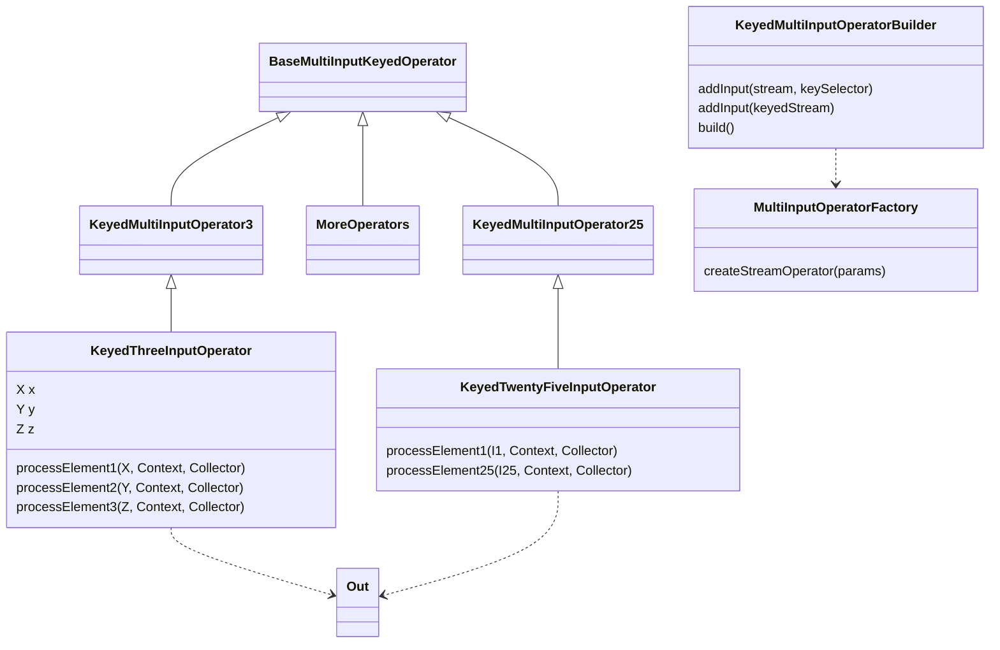

# flink-multi-input-operator

Keyed multi-input operator for Apache Flink streaming jobs.

Licensed under the Apache License, Version 2.0. See [LICENSE](LICENSE).

Proudly tested at [Auvik](https://www.auvik.com/). 

Use *at your own risk*! 😀 

**Requirements:** Java 11, Flink 2.2. Uses Maven Wrapper (no Maven install needed).

## Purpose

This library is a companion implementation for [FLINK-39131: Multi-Input Processors](https://issues.apache.org/jira/browse/FLINK-39131).

Its goal is to provide multi-way processing _à la_ `CoProcessFunction`, just for `N > 2`: a DataStream-level primitive for processing more than two keyed inputs within a single operator. In practice, this is useful for stateful multi-stream patterns such as multi-way joins, where expressing the logic as a chain of binary operators can create excessive intermediate state.

For a longer motivation and walkthrough, see [Multi-Way Joins](https://ds-co.dev/blog/multi-way-joins-cybernetically-enhanced/).

## Background

[FLIP-516: Multi-Way Join Operator](https://cwiki.apache.org/confluence/display/FLINK/FLIP-516%3A%2BMulti-Way%2BJoin%2BOperator) introduced a SQL/Table-runtime solution for multi-way joins in Apache Flink. That work addresses the state-explosion problem at the SQL layer by avoiding binary-join chains and their intermediate state. See more [here](https://nightlies.apache.org/flink/flink-docs-stable/docs/dev/table/tuning/#multiple-regular-joins).

This library explores the corresponding need at the DataStream layer: a built-in primitive that lets users process multiple keyed inputs in one operator without dropping down to Flink's low-level Operator API.

The relationship is:

- FLIP-516 addresses multi-way joins for SQL/Table workloads.
- [FLINK-37481: Multi way join operator](https://issues.apache.org/jira/browse/FLINK-37481) delivered the runtime operator used for that effort.
- FLINK-39131 proposes bringing the same kind of capability to the DataStream API as a reusable multi-input processing primitive.
- This repository exists as a concrete library and proving ground for that direction.

## Scope

This project is intentionally focused on a small, explicit abstraction: a keyed multi-input operator for DataStream jobs.

It is not an Apache Flink module, and it does not aim to mirror the whole internal Operator API. Instead, it packages a higher-level primitive that is easier to use in application code while staying aligned with the motivation behind FLINK-39131.

It is also adjacent to earlier discussions such as [FLIP-17: Side Inputs for DataStream API](https://cwiki.apache.org/confluence/display/FLINK/FLIP-17%3A+Side+Inputs+for+DataStream+API), but it targets a different use case: multiple equally important inputs processed symmetrically within one keyed operator, rather than a main input augmented by side inputs.

## Approach

The implementation relies on low-level, but public, Flink classes to overcome the current limitations of the DataStream API co-processors.

From a user's perspective, a `KeyedMultiInputOperatorBuilder` does the necessary wiring so the operator feels closer to a `(Keyed)MultiProcessFunction` than to Flink's lower-level Operator API.

For defining multi-way operators, this repository provides typed operator base classes:

`KeyedMultiInputOperator3` through `KeyedMultiInputOperator25` each target a specific number of inputs and keep the operator API typed per input. These classes are generated up to `N=25`, as typically done in these cases, e.g. for [tuples](https://github.com/apache/flink/tree/master/flink-core-api/src/main/java/org/apache/flink/api/java/tuple).



## Use This Library

The published artifact is available on [Maven Central](https://central.sonatype.com/artifact/dev.ds-co/flink-multi-input-operator). Add it to your Flink application with:

```xml
<dependency>
    <groupId>dev.ds-co</groupId>
    <artifactId>flink-multi-input-operator</artifactId>
    <version>x.y.z</version>
</dependency>
```

## Basic Usage Example

The usage would be as follows (`N=3`):

```java
KeyedMultiInputOperatorBuilder<String, Out> builder =
    new KeyedMultiInputOperatorBuilder<>(
        env,
        KeyedThreeInputOperator.class,
        TypeInformation.of(Out.class),
        Types.STRING
    );

builder
    .addInput(xs, X::getKey)
    .addInput(ys, Y::getKey)
    .addInput(zs, Z::getKey);

DataStream<Out> joined = builder.build("xyz-join");
```

where the user-defined operator would have one callback for each input channel:

```java
public class KeyedThreeInputOperator extends KeyedMultiInputOperator3<X, Y, Z, Out> {
  @Override
  protected void processElement1(X x, Context ctx, Collector<Out> out) throws Exception {
    lastX.update(x.getX());
    join(ctx, out);
  }

  @Override
  protected void processElement2(Y y, Context ctx, Collector<Out> out) throws Exception {
    lastY.update(y.getY());
    join(ctx, out);
  }

  @Override
  protected void processElement3(Z z, Context ctx, Collector<Out> out) throws Exception {
    lastZ.update(z.getZ());
    join(ctx, out);
  }
}
```

So, overall, this feels exactly like a `KeyedCoProcessFunction`, just for `N > 2`.

## Build

    ./mvnw clean package

## Test

    ./mvnw test

## Code Style

This project follows [Apache Flink's code style conventions](https://nightlies.apache.org/flink/flink-docs-stable/docs/flinkdev/ide_setup/#required-plugins).

Formatting is enforced by **Spotless** (google-java-format) and **Checkstyle** (based on Flink's `tools/maven/checkstyle.xml`). Both run automatically during `mvn verify`.

To auto-fix formatting:

    ./mvnw spotless:apply

### IntelliJ IDEA Setup

1. Install the **google-java-format** plugin ([v1.24.0.0](https://plugins.jetbrains.com/plugin/8527-google-java-format/versions/stable/631498)). Install via "Settings" → "Plugins" → gear icon → "Install Plugin from Disk". Make sure to never update this plugin. Enable it under "Settings" → "Other Settings" → "google-java-format Settings".
2. Install the **Checkstyle-IDEA** plugin. Under "Settings" → "Tools" → "Checkstyle", add `tools/checkstyle.xml` as a configuration file.
3. Enable "Optimize imports" and "Reformat code" under "Settings" → "Tools" → "Actions on Save".

## CI

GitHub Actions runs tests on every push/PR. The publish workflow stages artifacts locally and publishes them with JReleaser when a `v*` tag is pushed.

For manual release validation:

    ./mvnw -B clean verify
    ./mvnw -B -Ppublication deploy -DskipTests
    ./mvnw -B jreleaser:config
